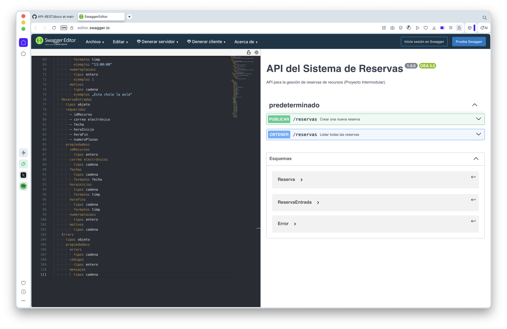

# 1. Análisis de Dominio: Sistema de Reservas (Proyecto Intermodular)

## 1.1. Estructura de Entidades
El sistema implementa la persistencia de datos relacionales basada en el modelo E/R propuesto para el proyecto intermodular. Las entidades principales gestionadas son:

* **Usuarios**: Incluye `Administrador` y `UsuarioNormal`, gestionando autenticación y perfil.
* **Recursos**: Elementos físicos sujetos a reserva, caracterizados por su descripción y capacidad.
* **Horario**: Define la disponibilidad recurrente de los recursos.
* **DisponibleEn**: Clase relacional (N:M) que vincula `Recursos` con `Horarios`.
* **Reservas**: Entidad central que vincula a un `Usuario` con un recurso en una franja horaria específica.

## 1.2. Flujo de Datos y Operaciones CRUD
La aplicación, desarrollada en **Java con conexión JDBC**, implementa las operaciones básicas de mantenimiento sobre todas las tablas:

* **Create**: Inserción de nuevos registros en las tablas.
* **Read**: Consultas generales y filtradas (ej. buscar por nombre, correo o disponibilidad).
* **Update**: Modificación de registros existentes.
* **Delete**: Eliminación de registros, garantizando la integridad referencial.

## 1.3. Arquitectura y Requisitos Técnicos
El proyecto sigue las directrices técnicas del "Proyecto Intermodular UT11":

* **Patrón de Diseño**: Implementación completa del patrón **MVC (Modelo-Vista-Controlador)**.
* **Estructura**: Código organizado en paquetes (`model`, `dao`, `view`, `controller`) para facilitar el mantenimiento.
* **Seguridad**: Protección de datos sensibles mediante el filtrado de campos expuestos y manejo adecuado de excepciones.
* **Integridad**: Validación de datos en la capa de persistencia para asegurar la consistencia entre las tablas relacionadas.

## Validación de la API

